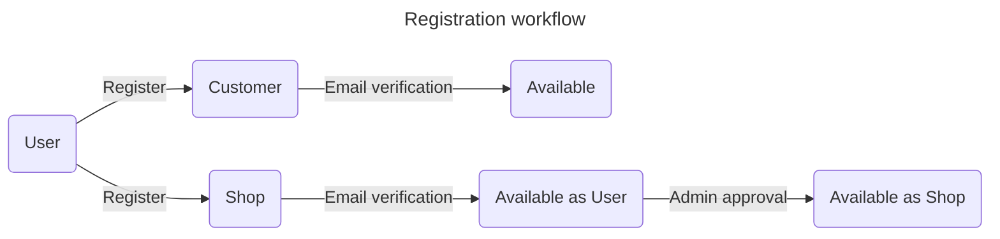
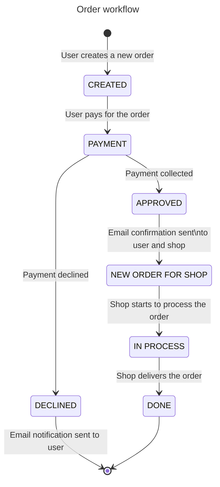

[section start]: <> (project_name)
## ShopOnline
[section end]: <> (project_name)

One of the first pet-projects on Django. Classic Marketplace where you can register as a customer or as a shop.
As a shop you have possibility to create your own shop, add products, manage orders, etc.
As a customer you can add products to your cart, wishlist, see all products, etc.
As a site admin you will have access to all shops, products, orders, etc. and you can manage them.
Services used in project: Stripe, SendGrid, Sentry, GoogleMapsAPI, Redis, Celery, Celery-beat, Docker, Docker-compose, PostgreSQL, etc.

#### Project Architecture

    ├── docker        <- Dockerfile.
    ├── app          <- Source code for use in this project.
    │    └── accounts       <- App with accounts.
    │    └── cart           <- App with cart.  
    │    └── customers      <- App with customers.
    │    └── marketplace    <- App with marketplace.
    │    └── orders         <- App with orders.
    │    └── payment        <- App with payment.
    │    └── settings       <- Django settings.
    │    └── shop           <- App with shop.
    ├── templates                   <- Folder with templates.
    ├── static                      <- Static files.
    ├── media                       <- Folder with media files.
    ├── requirements.txt            <- file to record dependencies for the development of the project
    ├── Makefile                    <- Makefile with commands like `make update_environment`
    ├── README.md                   <- The top-level README for developers using this project.
    ├── .pre-commit-config.yaml     <- config file for pre-commit hook
    ├── pyproject.toml              <- config file for black and isort
    └── .gitignore                  <- patterns and files to exclude from version control 
--------
### Workflow
*Shop-Online* is a basic Marketplace where you can register as a customer or as a shop.
In order to register yourself as a shop, you will need to provide additional information such as some required docs and shop's name.

Customer experience:
- You can add products to your cart.
- You can see your cart and manage products there.
- You can add products to your wishlist and also manage it.
- You can complete payment via Stripe.
- You can see all products and filter them by shop's/category's name.
- You can sign up for the newsletter.
- You can manage your profile settings, set up your avatar, change your password, etc.
- You can see your orders and their statuses.

Shop experience:
- Firstly, your shop need to be approved by the admin, before that you will have rights of the customer.
- You can create/change/delete categories and products.
- Your products need to be approved by the admin, then it became available for customers.
- You can manage your shop's settings, set up your avatar, cover photo, change shop's name, etc.
- As soon as you get a new order, you will get email notification about it.
- You can see your orders and manage their statuses.
- As soon as you changed status of the order, user will get email notification about status of order being changed.
- You can see general stats of your shop and filter it by time period.

--------
#### Dependency management

All dependencies will be managed via the requirements.txt file not with conda to save space.

When adding a dependency it is highly recommended specifying a minor version, i.e., pandas=1.0 instead of just pandas.
If there are no particular requirements for the version, specifying the next to last released minor version is a good dummy rule.

#### Formatting
To facilitate collaboration we use black formatting and isort to standardize formatting and the order of imports, configuration you can find in `pyproject.toml`.
These are deployed through a pre-commit hook implemented with the pre-commit library. It requires a config file 
`.pre-commit-config.yaml` where one can configure where they are applied. The hook is run at the top level directory
before you push any commits. This eases the process of reviewing changes.
